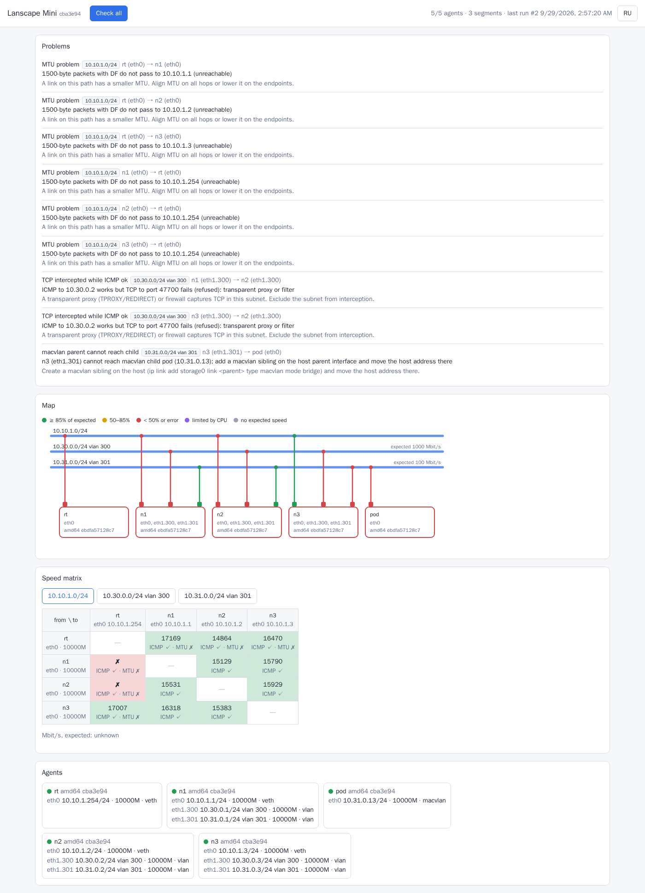
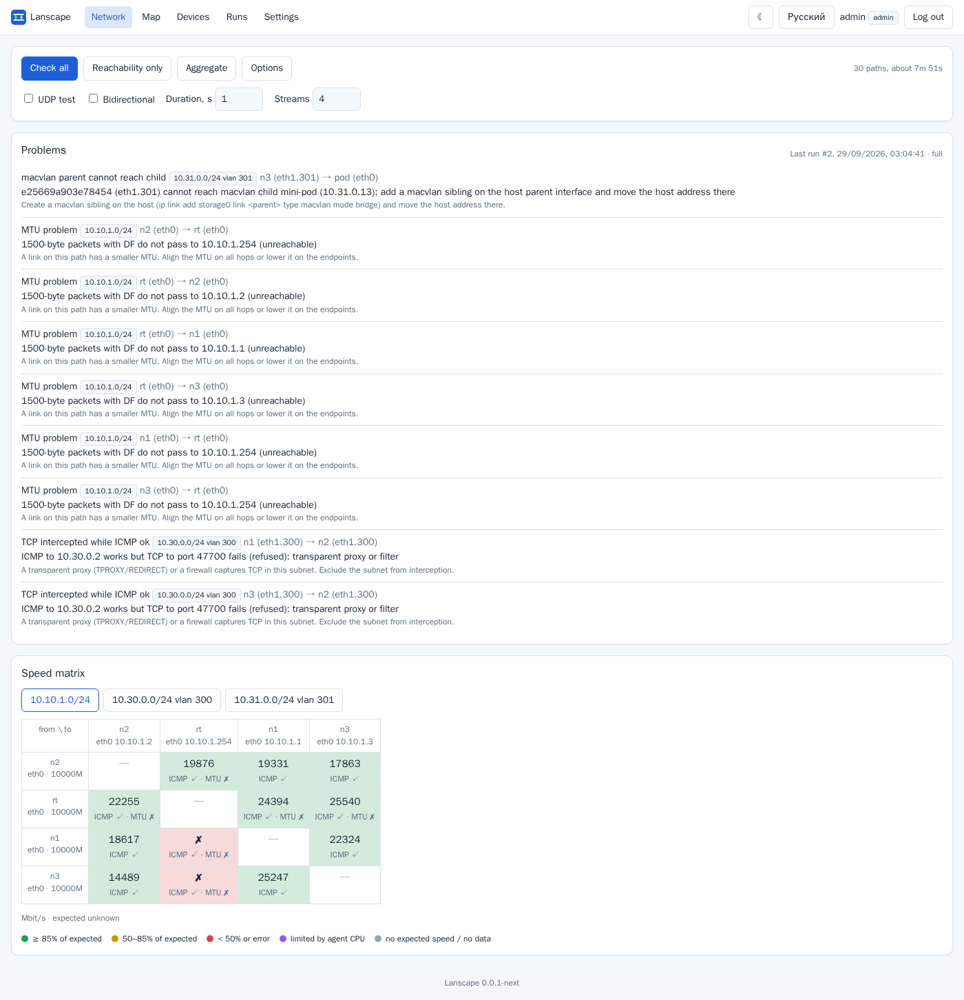
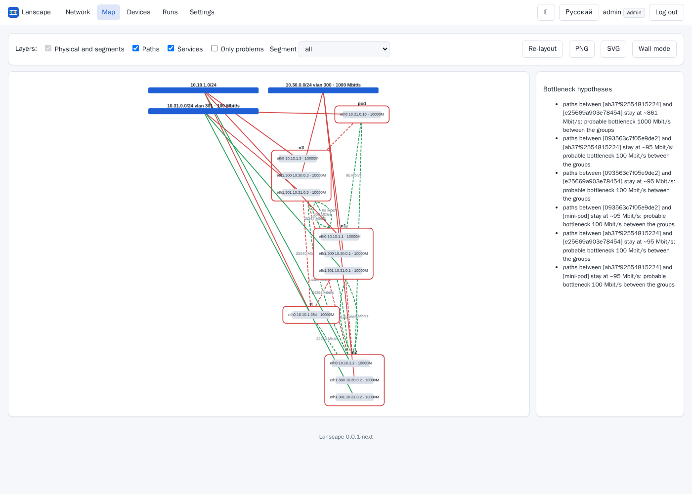

# Lanscape

Network paths, map and service uptime in one panel.

Lanscape ships in two editions:

- **Lanscape Mini** — a tiny network checker (`lsm-agent`, `lsm-server`) written in C that fits
  on a router with 16 MB of flash. One page: *Check all* → per-segment speed matrix → automatic map.
- **Lanscape** (Full) — a single panel for your whole infrastructure: network tests, map,
  service discovery, uptime monitoring and a dashboard.

Both editions share the data-plane test protocol (LSTP/1) and the segment model.

## Quick start: Lanscape Mini

```sh
# on the server host
curl -fsSL https://raw.githubusercontent.com/retreat-community/lanscape/main/scripts/install-mini.sh | sudo sh -s -- server --token SECRET
# on every node (routers: see docs/INSTALL.md for the OpenWrt packages)
curl -fsSL https://raw.githubusercontent.com/retreat-community/lanscape/main/scripts/install-mini.sh | sudo sh -s -- agent --server SERVER_IP --token SECRET
```

Open `http://SERVER_IP:8080` and press **Check all**. Every path (node pair × shared segment) is
measured separately with traffic bound to the interface: ping/RTT, MTU 1500 (and jumbo), TCP
throughput with 1 and 4 streams. The page shows a speed matrix per segment, an automatic map and
the list of problems: TCP intercepted while ICMP works, MTU, speed below expected, path mismatch,
macvlan parent/child.

| | `lsm-agent` | `lsm-server` |
|---|---|---|
| Size (static, mipsle) | < 128 KiB | < 512 KiB incl. the page |
| Platforms | Linux amd64, 386, arm64, armv7/6/5, mips/mipsle, mips64/le, riscv64, ppc64le; OpenWrt 24.10/25.12 | same |



## Quick start: Lanscape

```sh
docker run -d --name lanscape -p 8080:8080 -p 8443:8443 -v lanscape:/data \
  -e LANSCAPE_ADMIN_PASSWORD='change-me-please' -e LANSCAPE_GATEWAY_HOSTS=SERVER_IP \
  ghcr.io/retreat-community/lanscape:latest
```

Open `http://SERVER_IP:8080`, then **Settings → Agents → Add node** shows a ready install command
for Linux, Docker, Kubernetes, macOS, Windows, FreeBSD and OpenWrt. Agents register once with a
token and then talk to the server over mTLS; Lanscape Mini agents can join the same server.

The **Network** page runs the same per-path tests as Mini, explains every problem it finds and
keeps the history of runs; the **Map** shows segments, hosts and measured paths with bottleneck
hypotheses.

| Network | Map |
|---|---|
|  |  |

The interface is available in English and Russian ([screenshot](docs/screenshots/full-network-ru.png)).

## Documentation

- [Installation](docs/INSTALL.md) — Linux, OpenWrt, Docker, Kubernetes
- [Protocols](docs/PROTOCOL.md) — LSTP/1 data plane and control planes
- [Architecture decisions](docs/decisions/)
- [Specification](docs/SPEC.md)

## Support the project

Lanscape is free, without telemetry or paid plans. If it is useful to you, you can support the development with crypto (also on the **Support the project** page of the panel):

| Network | Assets | Address |
|---|---|---|
| Bitcoin | BTC | `bc1qzyc34w6jk9lhnagync80724wxhuklwfspk95ez` |
| Ethereum | ETH, USDT | `0x57D67fE406994fC7e5095a0edA72B2EB3A2AffA2` |
| TRON | TRX, USDT | `TRgcXpqvPrcntuq5ouHuJ7ofTyWqzQVBzu` |
| TON | TON, USDT | `UQBNRESRFYTtMeRQ5t-x1u-zEg14zOeTcUzBoBg6td25Eqcl` |

Send only the listed assets and only in the network of the address.

## License

GNU General Public License v3.0 or later, see [LICENSE](LICENSE) and [NOTICE](NOTICE).
